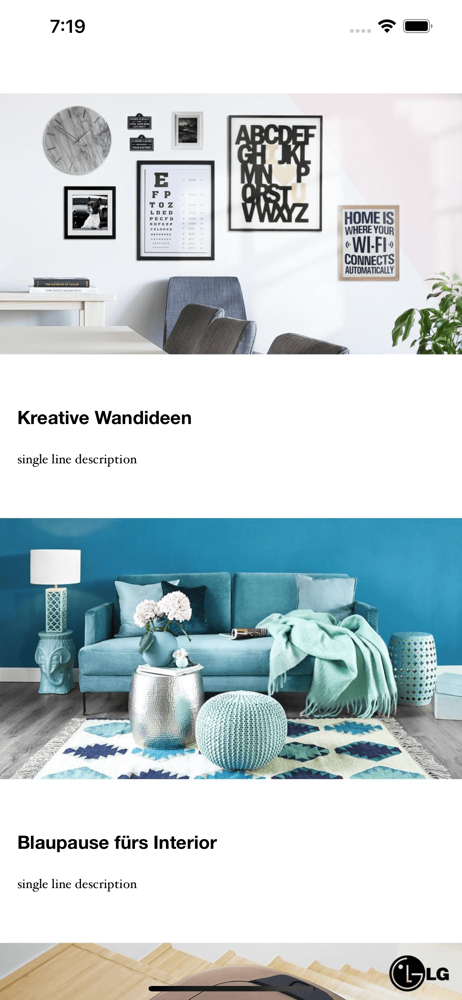

Campaign Browser
================

Loads a list of campaigns from the internet and displays them.

# Dependency Management

The project has some dependencies to third-party libraries. They are managed via [CocoaPods](https://cocoapods.org).
# Summary
Currently, the size of each cell has a fixed height. We want to change this to use a dynamic height based on the cell's content. Additionally, we want to change to position of text which is currently rendered on top of the image. We want to render all text contents below the image.

# Requirements
Use a dynamic height of the cell and make it dependent on the cell's contents.
The image should take the full available width of the screen and dynamically adjust its height with an aspect ratio of 4:3.
The text should go below the image. There should not be any space between the title text and the image, because the image already contains whitespace.
The text should have a padding of 8 points to the left and to the right.
There should be 8 points spacing between the title text and the description text.
The title text should break into two lines at most. Every text which is longer than two lines should be cut after the second line.
The description text should not have any length restrictions.
Setup local git repository and commit your changes

# Fixes
 As the minimum requirement of this project is iOS 12 so, I used customFlowLayout for self-sizing of collectionView.
 I have added a 4:3 ratio to the imageView and its width is equal to the screen size.
 I have moved the title below the image with top space 0 because of whitespaces in the image. Also, I added a maximum of 2 lines limit to the title, if the text is longer than the second line will be cut.
 The Leading and trailing of the title are 8.
 The description label will grow according to its content.
 I have added some screenshots to the repo. Details are following.
 
 1. "color-shades-items" - I have added some color to each component of CollectionViewCell to get a clear idea that every item is taking appropriate space.
 
 
 2. "with-image-10-3 -Aspect" - I have changed the aspect ratio of the image to 10:3 to see whether the cell in the screen is shrinking and items are showing properly.
 
  

 3. "with-large-title" - I added a dummy text to the title to check the 2 line validation and after that, it should start cutting.
 
   

 4. "with-single-line" - For testing I just added a single line description to check the self-sizing of the cell.
 
    

 5. "screenshot-fix" - Final lookup of the screen after the fix.
 
    

